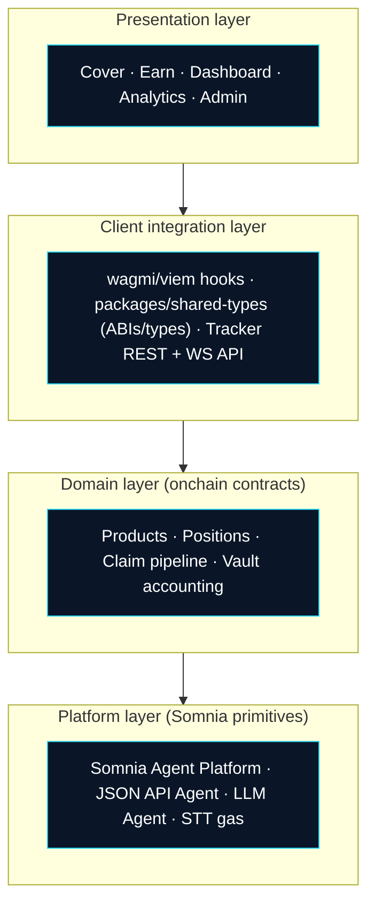
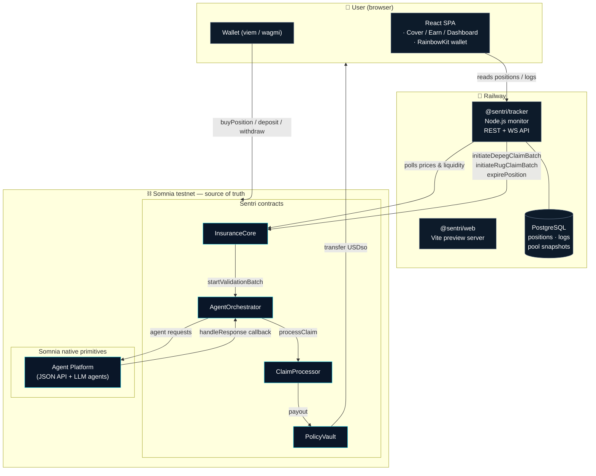
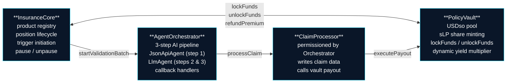
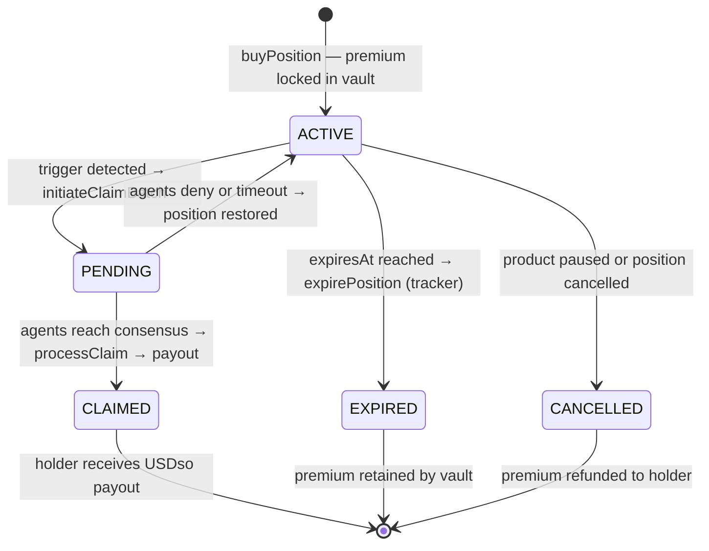
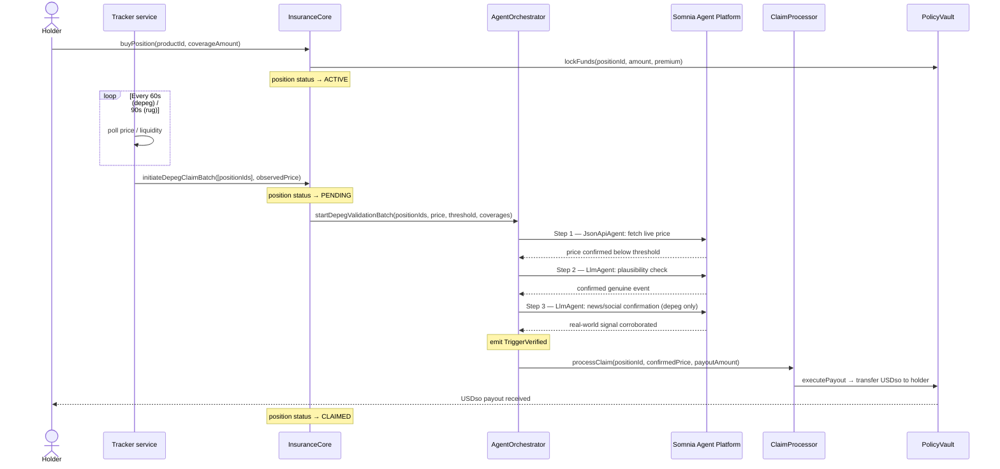
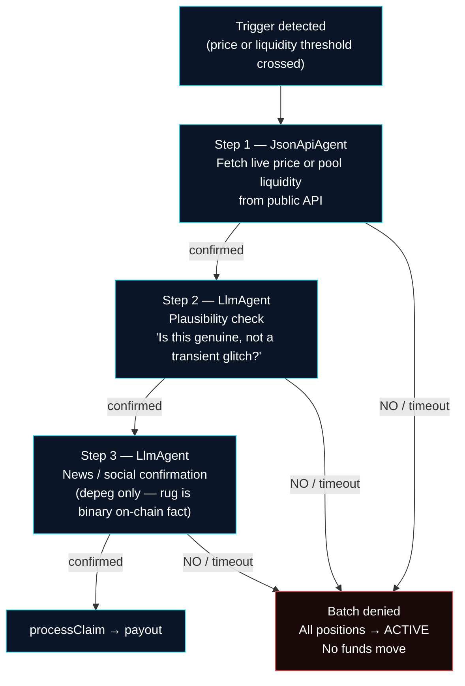
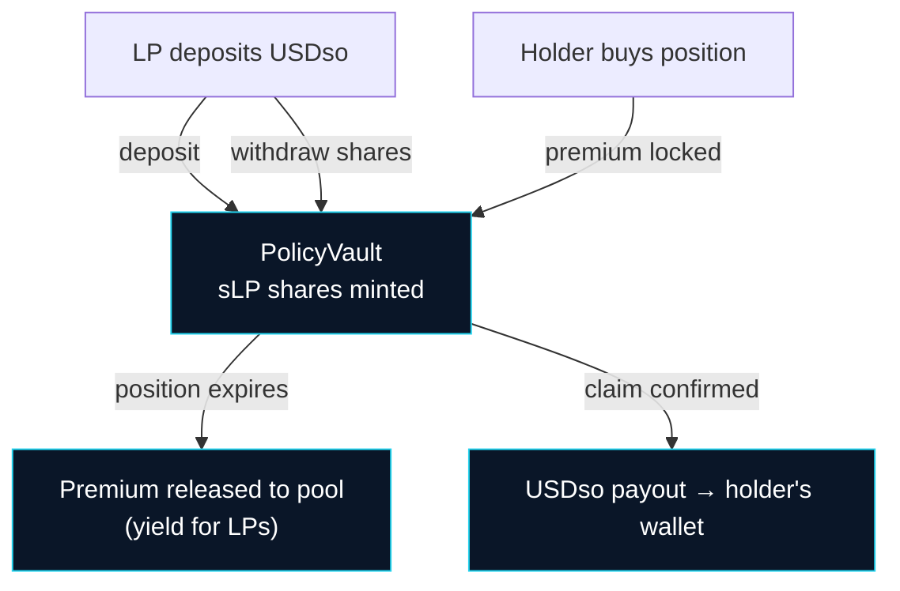
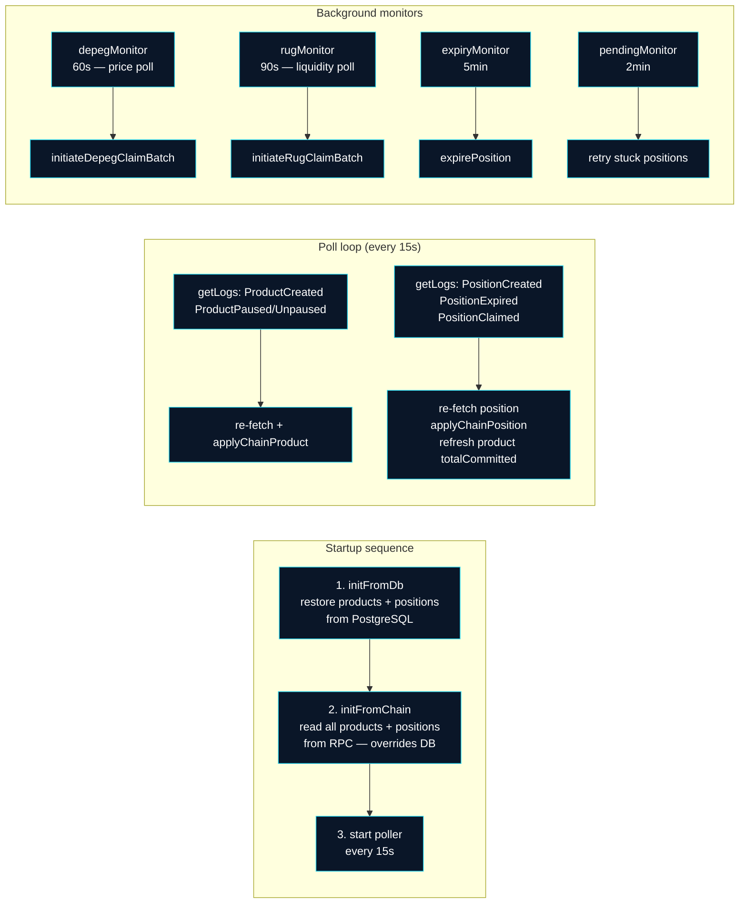

# 🏗️ Sentri — System Architecture

Sentri is a **fully onchain parametric insurance protocol** on Somnia (Shannon testnet, chainId 50312). Users buy instant coverage against DeFi risks — stablecoin depegs and rug pulls — and Somnia AI agents autonomously verify trigger events and execute payouts. **No claim forms, no adjusters, no waiting period.**

This document is the map of how it all fits together. Diagrams render natively on GitHub.

---

## 1. High-Level Design (HLD)

### 1.1 Purpose & scope
Sentri replaces the human adjuster with a multi-step AI agent consensus pipeline. When a trigger event occurs, an off-chain tracker detects it and initiates an onchain validation batch. Three AI agents — a JSON API agent, an LLM plausibility agent, and an LLM news agent — independently verify the event. Only when all required agents reach consensus does the `ClaimProcessor` execute a payout from `PolicyVault` to the holder's wallet. This HLD describes the system at the level of components, responsibilities, data flow, and the quality attributes that shaped the design.

### 1.2 Goals & non-goals
| Goals | Non-goals (deliberately out of scope) |
|---|---|
| Every claim decision is **onchain & verifiable** | Mainnet-grade economic hardening / audits |
| Payouts execute **automatically** — no human in the loop | DAO governance / token voting |
| **Funds can never get stuck** — pull-based LP exits | On-chain price oracles (tracker uses off-chain price feeds) |
| LPs earn **dynamic yield** scaled by utilization | Mobile-native client |
| Frontend is **replaceable** — the chain is the API | Off-chain indexer / subgraph |

### 1.3 Design principles
- **Agents as the source of truth.** No oracle, no admin key decides whether a claim pays out. All validation flows through Somnia Agents, with callback handlers enforcing `msg.sender == platform` — the orchestrator cannot be spoofed.
- **Isolate money.** `PolicyVault` holds all liquidity. `InsuranceCore` holds all product and position logic. They communicate through narrow interfaces — the money surface can be reasoned about in isolation.
- **Pull-based LP exits.** LPs call `withdraw(shares)` themselves. No push loop distributes yield, so no gas exhaustion vector can freeze the pool.
- **Incremental on-chain state, off-chain monitoring.** The tracker initiates the agent pipeline but holds no privileged on-chain role beyond calling `expirePosition`. All consequential decisions happen in contracts.
- **Single source of truth for integration.** ABIs and addresses are centralised in `packages/shared-types` and `packages/config`, consumed by both the web app and the tracker.

### 1.4 Logical view (layers)



### 1.5 Deployment view
- **User's browser** — React SPA, wallet signing via RainbowKit. No server-side secrets touch funds.
- **Railway (two services)** — `@sentri/web` (Vite preview) serves the frontend; `@sentri/tracker` (Node.js) monitors the chain, drives the agent pipeline, and serves the REST + WebSocket API.
- **PostgreSQL (Railway managed)** — tracker persists products, positions, agent logs, and pool snapshots for fast startup and analytics.
- **Somnia testnet** — the four Sentri contracts plus the native Somnia Agent Platform. The only stateful, authoritative tier.

### 1.6 Quality attributes
| Attribute | How it's achieved |
|---|---|
| **Trustlessness** | All claim decisions run through Somnia Agents; callbacks enforce `msg.sender == platform` |
| **Liveness** | Payouts are push to holder but LP withdrawals are pull-based; no loop can be bricked by crowd size |
| **Security** | Funds isolated in `PolicyVault`; `ClaimProcessor` callable only by `AgentOrchestrator`; no upgradeability |
| **Availability** | Tracker restores from PostgreSQL on restart — frontend serves stale data instantly while chain sync catches up |
| **Scalability** | Chain reads are direct from RPC; settlement cost is independent of number of positions |

### 1.7 Trust boundary
The boundary sits **between the tracker and the chain**. The tracker, web app, and Railway services are untrusted — they can be replaced, compromised, or taken offline without affecting on-chain state or funds. A compromised tracker can call `expirePosition` (refunds premiums) but cannot drain funds or forge a payout. A compromised frontend changes nothing on-chain.

---

## 2. The big picture (containers)



**Design principle:** the frontend is fully replaceable. Any client reading the same contracts sees the same products, positions, and claims. The tracker is a convenience layer — on startup it reads the full chain state; it is not the authority.

---

## 3. Contract suite

Four single-purpose contracts. Money is isolated in one contract (`PolicyVault`) you can audit on its own.



| Contract | Address | Key access control |
|---|---|---|
| `PolicyVault` | [`0x4f6D...A40A`](https://shannon-explorer.somnia.network/address/0x4f6D51B207F1eA053bF224b72316c4DAF170A40A#code) | `lockFunds` / `unlockFunds` only callable by `InsuranceCore`; payouts only by `ClaimProcessor` |
| `InsuranceCore` | [`0x5603...A127`](https://shannon-explorer.somnia.network/address/0x5603426365FC334E3eaF8c31c59BDA8ED223A127#code) | Trigger initiation open to tracker address; pause callable by owner or tracker |
| `ClaimProcessor` | [`0x8106...638E`](https://shannon-explorer.somnia.network/address/0x81066a0d13e6C359360954516Ad63F6B1aFd638E#code) | `processClaim` callable only by `AgentOrchestrator` |
| `AgentOrchestrator` | [`0xA50F...5BD3`](https://shannon-explorer.somnia.network/address/0xA50F7Fd25DdC86546202f7501873EB7E66175BD3#code) | Callbacks enforce `msg.sender == address(platform)` |

---

## 4. Position lifecycle (state machine)



---

## 5. End-to-end claim flow



**If any step fails** — agent returns NO, times out, or reverts — the batch is denied, all positions revert to ACTIVE, and no funds move.

---

## 6. Agent validation pipeline

All validation is onchain. Each step is an agent request emitted as a transaction; the response arrives as a callback from the Somnia Agent Platform.



| Step | Agent | Coverage types | What it checks |
|------|-------|---------------|----------------|
| 1 | `JsonApiAgent` | Both | Live price or liquidity from a public API |
| 2 | `LlmAgent` | Both | Plausibility — genuine event vs. transient noise |
| 3 | `LlmAgent` | Depeg only | News / social signal — real-world corroboration |

Rug pull claims skip Step 3 because liquidity collapse is a binary, verifiable on-chain fact.

---

## 7. Money flow & LP yield model



### Dynamic yield multiplier (a deliberate engineering decision)

Raw APY scales with how much capital is at risk. Higher utilization means more locked funds backing active positions, so LPs earn more to compensate:

| Utilization | Multiplier | Rationale |
|-------------|-----------|-----------|
| < 50% | 1× | Low exposure, base yield |
| 50–70% | 1.5× | Moderate exposure |
| 70–90% | 2× | High exposure |
| > 90% | 3× | Near-capacity — maximum incentive to attract liquidity |

The multiplier is stored in `PolicyVault.utilizationMultiplierBps` and applied at position creation time.

### Payout formulas

**Depeg (proportional)** — partial loss is realistic for a peg slip:
```
payout = coverage × (threshold − triggerPrice) / threshold
```
Example: $5,000 coverage, threshold $0.97, price at $0.90 → payout ≈ $361

**Rug pull (binary full payout)** — a confirmed rug is near-total loss; proportional would be meaningless:
```
payout = coverage (full)
```

---

## 8. USDso token model

Sentri uses `USDso` as its payment and coverage denomination. USDso is an 18-decimal token, but Sentri reads only 13 of those decimals, making **1 USDso = 100,000 USDso coverage value** in the UI.

This means a user holding 0.01 USDso can buy $1,000 of coverage — a deliberate decision to make testnet interaction practical without needing large token balances.

```
Raw on-chain amount = parseUnits(userAmount, 13)
Display amount      = rawAmount / 10^13
```

All contracts, the tracker, and the frontend use 13 as the decimal precision consistently.

---

## 9. Tracker architecture



The tracker also watches `AgentOrchestrator` events (`BatchValidationStarted`, `StepAdvanced`, `TriggerVerified`, `TriggerDenied`) in real time via `watchContractEvent` and records them as agent log entries streamed to connected frontend clients over WebSocket.

---

## 10. Security considerations

**Agent callback spoofing** — `AgentOrchestrator` enforces `require(msg.sender == address(platform))` in all callback handlers. No external actor can forge a validation result.

**Fund isolation** — `PolicyVault` accepts `lockFunds` only from `InsuranceCore` and payouts only from `ClaimProcessor`. Neither role is assumable by an arbitrary address.

**Tracker compromise** — A compromised tracker key can call `expirePosition` (cancels positions, refunds premiums) and `initiateClaimBatch` (starts agent pipeline, but agents must still reach independent consensus). It cannot move funds directly or forge a payout.

**No upgradability** — Contracts are not upgradeable proxies. The deployed bytecode is the protocol. Verified source code is on [Somnia explorer](https://shannon-explorer.somnia.network).

**Pause mechanism** — Any product can be paused by the owner or tracker address, halting new purchases without affecting existing positions.

---

## 11. Tech stack

| Layer | Choice | Why |
|---|---|---|
| Contracts | Solidity `^0.8.24`, Hardhat, OpenZeppelin | Overflow-safe by default; battle-tested access control |
| AI validation | Somnia Agent Platform (JSON API + LLM agents) | Claim decisions are trustless, not API calls |
| Frontend | React 18, Vite, Wagmi v2, RainbowKit | Typed chain reads/writes; wallet UX out of the box |
| 3D / animation | Three.js, Framer Motion | Agent network scene; client-side, no server cost |
| Tracker | Node.js, TypeScript, viem | Typed contract reads; Somnia RPC chunked log polling |
| Database | PostgreSQL + Drizzle ORM | Fast startup restore; analytics queries |
| Monorepo | Yarn 4 (Berry) workspaces, Turborepo | `@sentri/shared-types` = single source of domain types |
| Deployment | Railway (web + tracker) | Managed Postgres, zero-config deploys from main |

---

## 12. Repo layout

```
.
├── apps/
│   ├── web/              React SPA — Cover, Earn, Dashboard, Analytics, Admin
│   │   └── src/
│   │       ├── pages/    one file per route
│   │       ├── components/
│   │       └── lib/      contracts.ts, wagmi.ts, utils.ts
│   └── tracker/          Node.js monitor + REST/WebSocket API
│       └── src/
│           ├── monitors/ depeg · rug · expiry · pending
│           ├── services/ contractService · positionService · databaseService
│           └── api/      dashboardApi (Express)
├── packages/
│   ├── contracts/        Hardhat — 4 Solidity contracts + deploy scripts
│   ├── shared-types/     Domain types (Position, Product, PoolStats…)
│   └── config/           Chain constants, ABIs, addresses
├── ARCHITECTURE.md       this file
├── README.md
├── turbo.json
└── package.json
```

---

*Sentri Protocol · Somnia Agentathon 2026*
